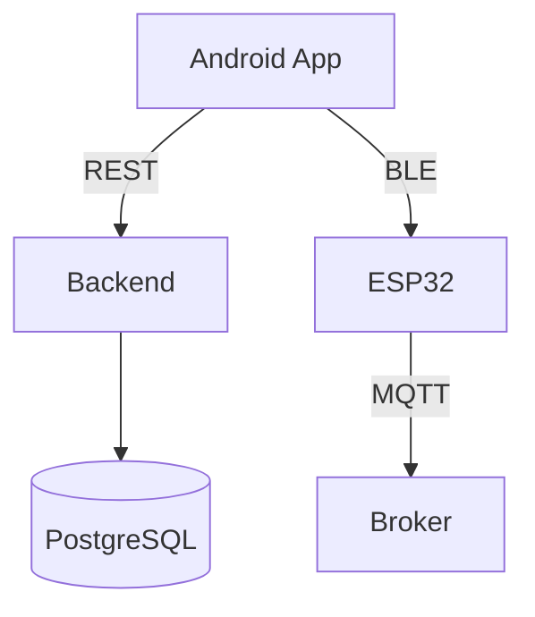

# Monorepo: Backend (Node+TS+Express), Android (Kotlin+Compose), ESP32 (PlatformIO)

This repository is a multi-project monorepo containing:

- `backend`: Node.js + TypeScript + Express API
- `android`: Android app written in Kotlin with Jetpack Compose
- `esp32`: PlatformIO project targeting ESP32 (Arduino framework)

## Quick start

- Backend
  - Install deps: `cd backend && npm ci`
  - Run dev: `npm run dev`
  - Test: `npm test`
  - Lint: `npm run lint`
  - Build: `npm run build`
  - Docker: `docker build -t backend:dev backend && docker run --rm -p 3000:3000 --env-file backend/.env backend:dev`

- Android
  - Open `android` in Android Studio (Hedgehog or newer). JDK 17 and SDK 34.
  - CLI (CI-managed): lint/test via Gradle action

- ESP32
  - Requires PlatformIO (`pip install --user platformio`)
  - Build: `cd esp32 && pio run`
  - Upload: `pio run -t upload`

## Architecture (at a glance)



## Documentation
- English docs: `docs/en/`
- Česká dokumentace: `docs/cs/`

## CI
GitHub Actions run per-package lint/test/build:
- Backend: Node 22, `npm ci`, ESLint, Jest, `tsc` build
- Android: JDK 17, Android SDK 34, Gradle 8.7 via action, runs `lint test`
- ESP32: Python + PlatformIO, runs `pio run`

## Configuration & Security
- Backend env: see `backend/.env.example`. Do not commit secrets. Use repository or org secrets in CI.
- Android: do not hardcode secrets; prefer remote config; handle runtime permissions for camera/BLE/location.
- ESP32: avoid embedding production credentials; use provisioning.

See `CONTRIBUTING.md` and `SECURITY.md` for details.

## Structure
```
backend/
android/
esp32/
.github/workflows/
```
