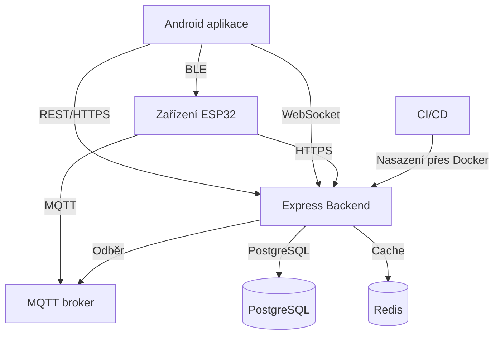
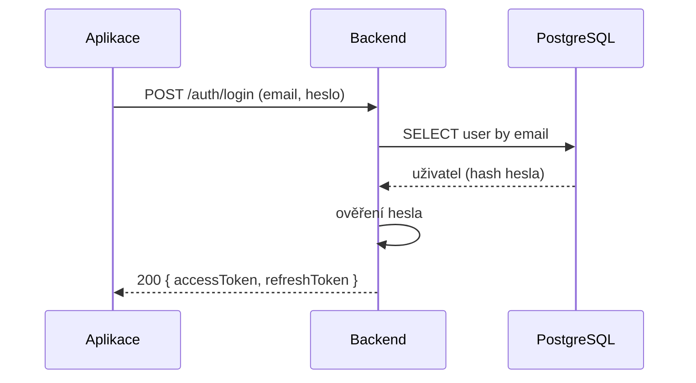
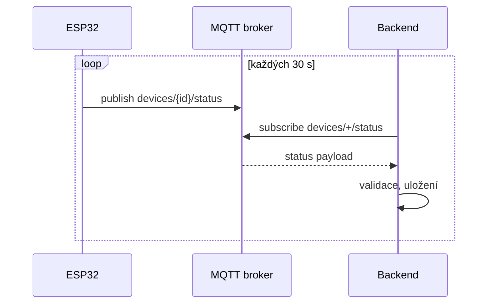
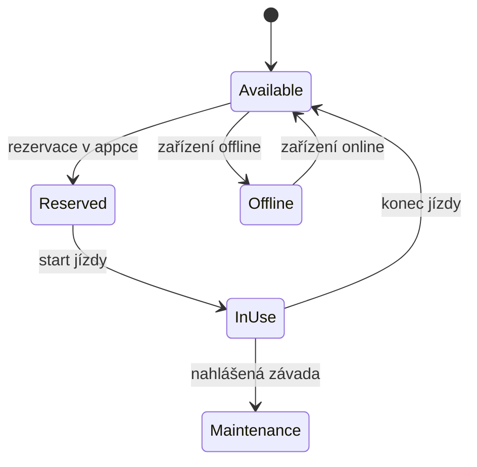

# Architektura systému

Nejprve „ukázat“, pak vysvětlit.

```mermaid
graph TD
  App[Android aplikace] -->|REST/HTTPS| Backend[Express Backend]
  App -->|WebSocket| Backend
  App -->|BLE| ESP32[Zařízení ESP32]
  ESP32 -->|MQTT| Broker[MQTT broker]
  Backend -->|Odběr| Broker
  ESP32 -->|HTTPS| Backend
  Backend -->|PostgreSQL| DB[(PostgreSQL)]
  Backend -->|Cache| Redis[(Redis)]
  CI[CI/CD] -->|Nasazení přes Docker| Backend
```

## Datové toky

### Přihlášení a vydání tokenů

```mermaid
sequenceDiagram
  participant A as Aplikace
  participant B as Backend
  participant DB as PostgreSQL
  A->>B: POST /auth/login (email, heslo)
  B->>DB: SELECT user by email
  DB-->>B: uživatel (hash hesla)
  B->>B: ověření hesla
  B-->>A: 200 { accessToken, refreshToken }
```

### Telemetrie z ESP32

```mermaid
sequenceDiagram
  participant E as ESP32
  participant M as MQTT broker
  participant S as Backend
  loop každých 30 s
    E->>M: publish devices/{id}/status
    S->>M: subscribe devices/+/status
    M-->>S: status payload
    S->>S: validace, uložení
  end
```

### Životní cyklus koloběžky

```mermaid
stateDiagram-v2
  [*] --> Available
  Available --> Reserved : rezervace v appce
  Reserved --> InUse : start jízdy
  InUse --> Available : konec jízdy
  InUse --> Maintenance : nahlášená závada
  Available --> Offline : zařízení offline
  Offline --> Available : zařízení online
```
