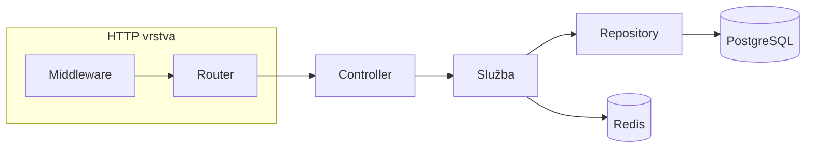
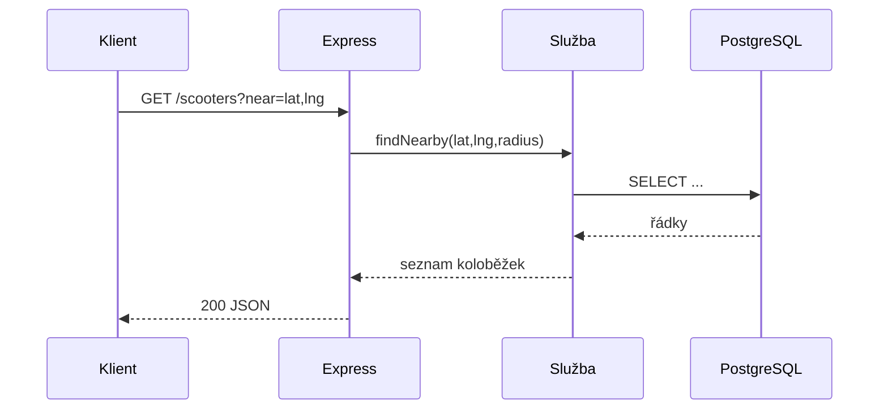

# Backend (Express + TypeScript)

```mermaid
flowchart LR
  subgraph HTTP vrstva
    MW[Middleware] --> RT[Router]
  end
  RT --> CT[Controller]
  CT --> SV[Služba]
  SV --> RP[Repository]
  RP --> DB[(PostgreSQL)]
  SV --> Cache[(Redis)]
```

- Endpointy: začněte `GET /health`, rozšiřte o auth, scooters, rides.
- Konfigurace: `.env` s `PORT`, `JWT_SECRET`, `DATABASE_URL`.

## Průběh požadavku

```mermaid
sequenceDiagram
  participant C as Klient
  participant H as Express
  participant S as Služba
  participant P as PostgreSQL
  C->>H: GET /scooters?near=lat,lng
  H->>S: findNearby(lat,lng,radius)
  S->>P: SELECT ...
  P-->>S: řádky
  S-->>H: seznam koloběžek
  H-->>C: 200 JSON
```
