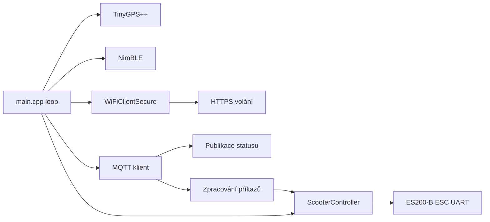

# ESP32 Firmware (PlatformIO)



## Knihovna řízení koloběžky (`esp32-multi/lib/scooter_control`)

Přenositelný C++ modul pro ESC koloběžky ES200-B, rozdělený tak, aby logika
byla jednotkově testovatelná na PC bez hardwaru:

- **`scooter_protocol`** — kodek 6bajtového rámce s CRC-8/MAXIM a bitovým polem
  příkazu. Čisté funkce.
- **`reliability.h`** — znovupoužitelné pomocníky `Interval`, `Backoff`,
  `Watchdog` (čas se vkládá zvenčí, uvnitř žádné `millis()`).
- **`scooter_controller`** — stavový automat přidávající **spolehlivost**
  (obnovování keep-alive, hlídací pes spoje → nouzové zastavení) a
  **redundanci** (více výstupních spojů `ITransport` s automatickým
  přepnutím a exponenciálním zpožděním).

Příkazové téma (`devices/esp32multi/cmd`): `RUN`/`UNLOCK`, `STOP`/`LOCK`, `PING`.

Spuštění testů na PC:

```bash
./esp32-multi/test/run_tests.sh
```

## Příklad telemetrie
```json
{
  "scooter_id": "abc-123",
  "battery": 83,
  "location": {"lat": 49.277, "lng": 16.998},
  "ts": 1712345678
}
```
