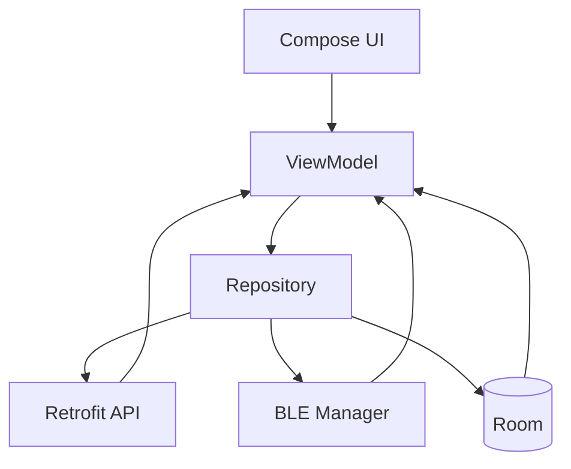

# Android App (Kotlin + Compose)

```mermaid
flowchart TB
  UI[Compose UI] --> VM[ViewModel]
  VM --> Repo[Repository]
  Repo --> API[Retrofit API]
  Repo --> BLE[BLE Manager]
  Repo --> DB[(Room)]
  API --> VM
  BLE --> VM
  DB --> VM
```

- Navigation: Map → Ride → Profile
- Permissions: Camera, BLE, Location
- DI: Hilt modules under `di/`
