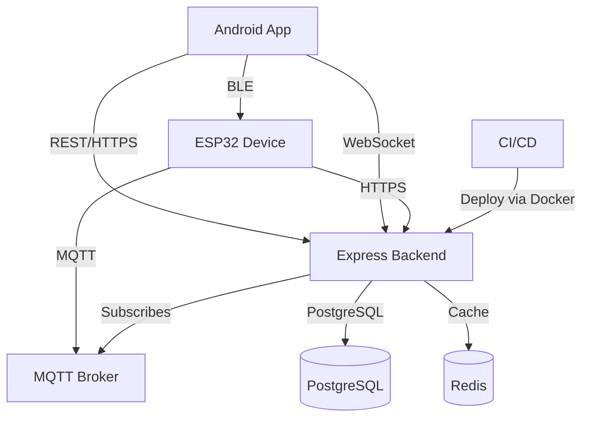
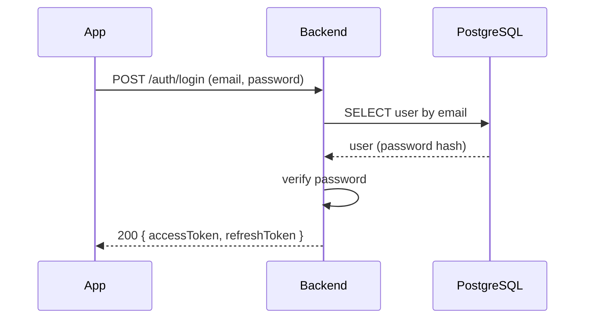
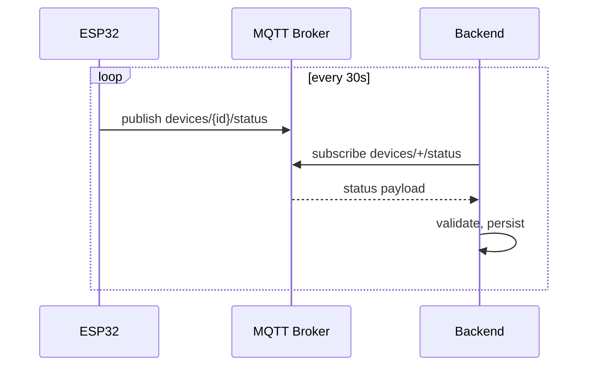
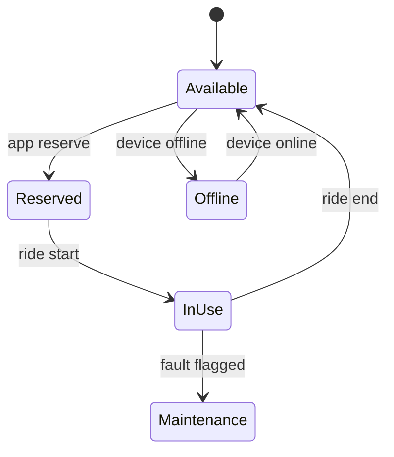

# System Architecture

This document "shows" the system via diagrams first.

```mermaid
graph TD
  UserApp[Android App] -->|REST/HTTPS| Backend[Express Backend]
  UserApp -->|WebSocket| Backend
  UserApp -->|BLE| ScooterESP32[ESP32 Device]
  ScooterESP32 -->|MQTT| Broker[MQTT Broker]
  Backend -->|Subscribes| Broker
  ScooterESP32 -->|HTTPS| Backend
  Backend -->|PostgreSQL| DB[(PostgreSQL)]
  Backend -->|Cache| Redis[(Redis)]
  CI[CI/CD] -->|Deploy via Docker| Backend
```

## Data flows

### Login and token issuance

```mermaid
sequenceDiagram
  participant A as App
  participant B as Backend
  participant DB as PostgreSQL
  A->>B: POST /auth/login (email, password)
  B->>DB: SELECT user by email
  DB-->>B: user (password hash)
  B->>B: verify password
  B-->>A: 200 { accessToken, refreshToken }
```

### Telemetry ingest from ESP32

```mermaid
sequenceDiagram
  participant E as ESP32
  participant M as MQTT Broker
  participant S as Backend
  loop every 30s
    E->>M: publish devices/{id}/status
    S->>M: subscribe devices/+/status
    M-->>S: status payload
    S->>S: validate, persist
  end
```

### Scooter lifecycle

```mermaid
stateDiagram-v2
  [*] --> Available
  Available --> Reserved : app reserve
  Reserved --> InUse : ride start
  InUse --> Available : ride end
  InUse --> Maintenance : fault flagged
  Available --> Offline : device offline
  Offline --> Available : device online
```
