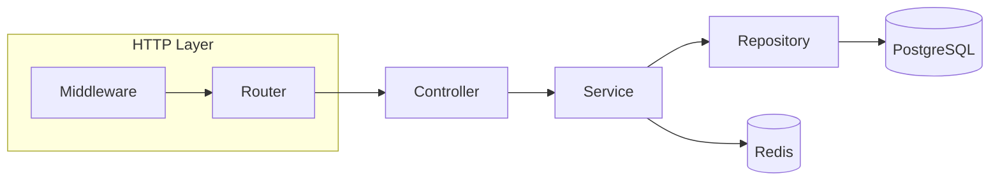
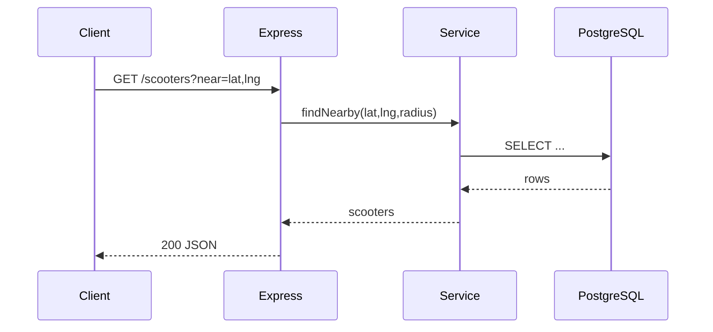

# Backend (Express + TypeScript)

- Endpoints: start with `GET /health`, extend with auth, scooters, rides.
- Config: `.env` with `PORT`, `JWT_SECRET`, `DATABASE_URL`.

## Example request lifecycle

