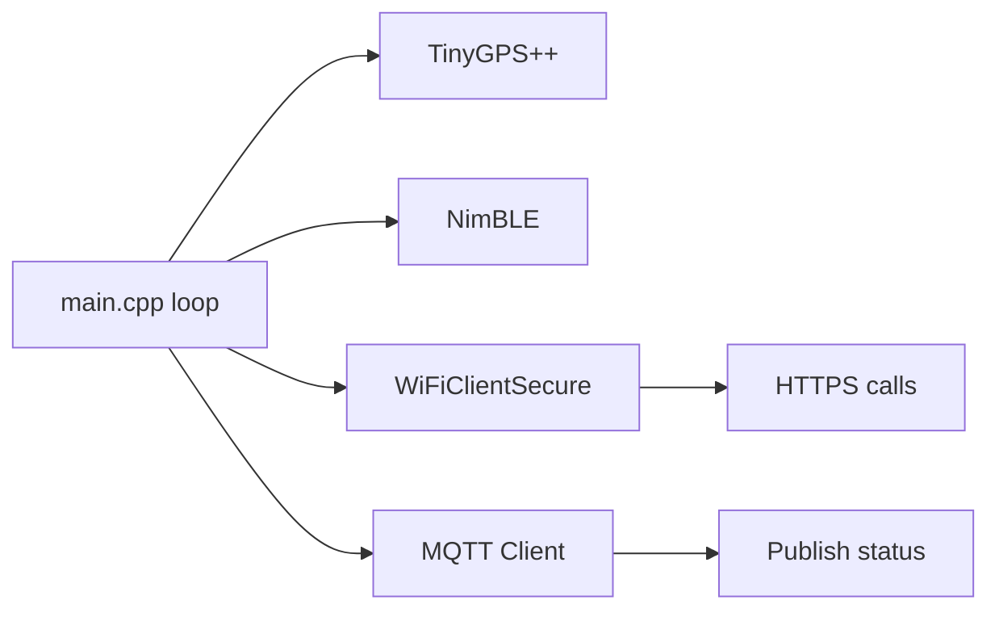

# ESP32 Firmware (PlatformIO)


```mermaid
flowchart LR
  Main[main.cpp loop] --> GPS[TinyGPS++]
  Main --> BLE[NimBLE]
  Main --> HTTP[WiFiClientSecure]
  Main --> MQTT[MQTT Client]
  MQTT --> Pub[Publish status]
  HTTP --> REST[HTTPS calls]
```

## Telemetry payload (example)
```json
{
  "scooter_id": "abc-123",
  "battery": 83,
  "location": {"lat": 49.277, "lng": 16.998},
  "ts": 1712345678
}
```
