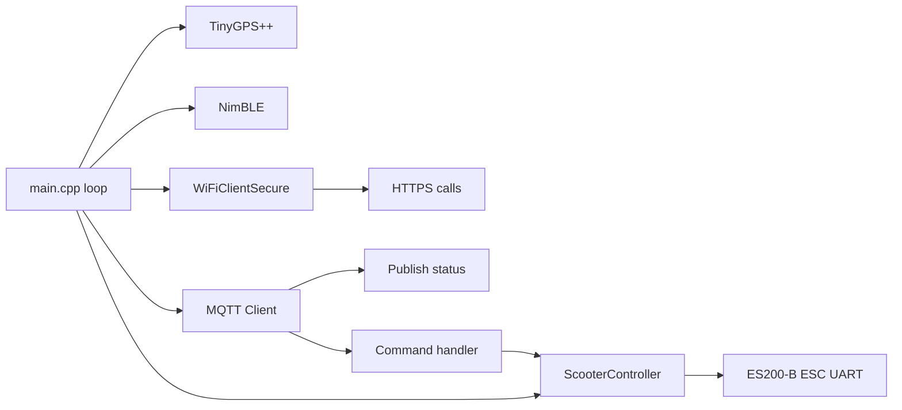
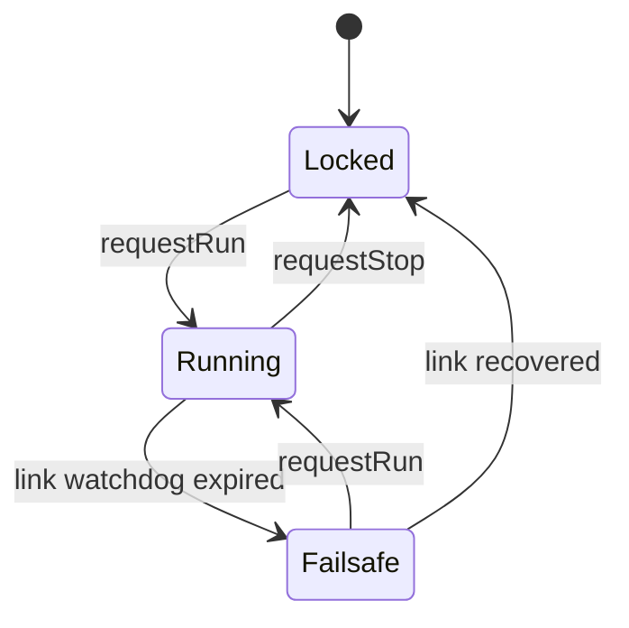

# ESP32 Firmware (PlatformIO)



## Scooter control library (`esp32-multi/lib/scooter_control`)

A portable, dependency-free C++ module for the ES200-B scooter ESC, split so
the logic is unit-testable on a host without hardware:

- **`scooter_protocol`** — 6-byte frame codec with CRC-8/MAXIM and a command
  bit-field. Pure functions.
- **`reliability.h`** — reusable `Interval`, `Backoff`, `Watchdog` helpers
  (time injected, no `millis()` inside).
- **`scooter_controller`** — state machine adding **reliability** (keep-alive
  refresh, link watchdog → failsafe stop) and **redundancy** (multiple
  `ITransport` output links with automatic failover + backoff).



Command topic (`devices/esp32multi/cmd`): `RUN`/`UNLOCK`, `STOP`/`LOCK`, `PING`.

Run the host tests:

```bash
./esp32-multi/test/run_tests.sh
```

## Telemetry payload (example)
```json
{
  "scooter_id": "abc-123",
  "battery": 83,
  "location": {"lat": 49.277, "lng": 16.998},
  "ts": 1712345678
}
```
