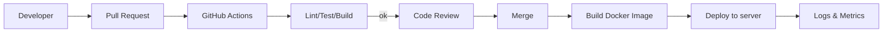

# Operations and CI/CD

```mermaid
flowchart LR
  Dev[Developer] --> PR[Pull Request]
  PR --> CI[GitHub Actions]
  CI --> Lint[Lint/Test/Build]
  Lint -- ok --> Review[Code Review]
  Review --> Merge
  Merge --> Docker[Build Docker Image]
  Docker --> Deploy[Deploy to server]
  Deploy --> Monitor[Logs & Metrics]
```

- Separate environments: dev/staging/prod
- Secrets via CI or orchestrator, never in VCS
